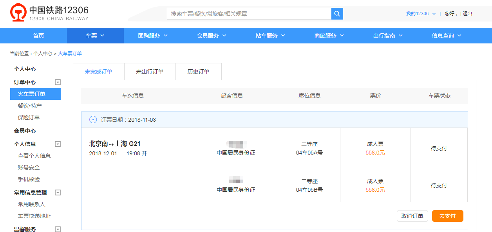
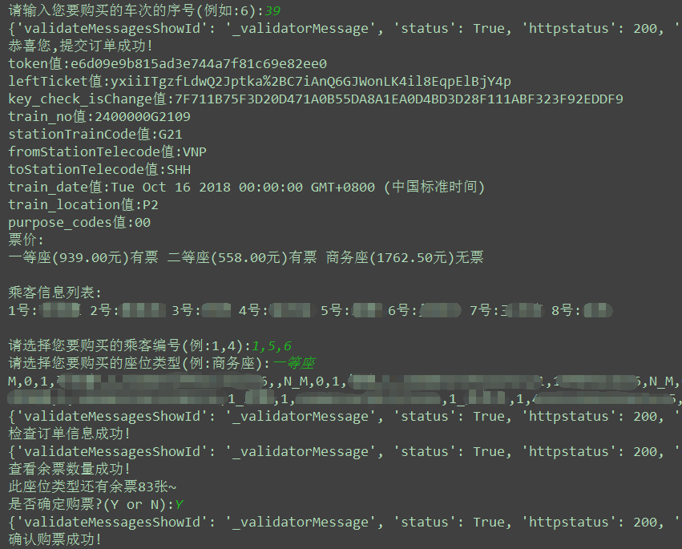
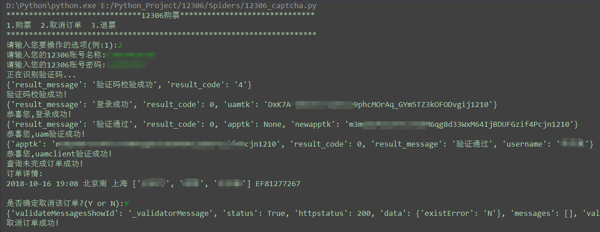
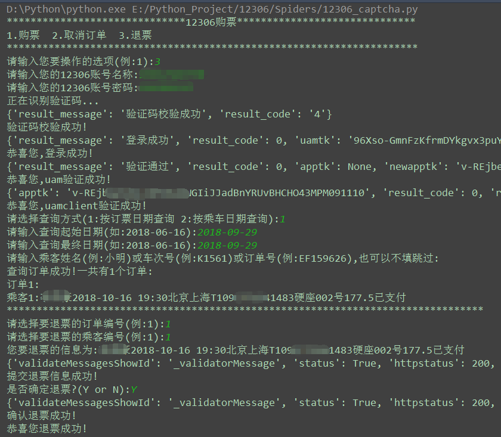

12306购票程序 
===========================
   
### 12306官网 - https://kyfw.12306.cn/otn/leftTicket/init 
|Author|:sunglasses:Henryhaohao:sunglasses:|
|---|---
|Email|:hearts:1073064953@qq.com:hearts:

    
****
## :dolphin:声明
### 软件均仅用于学习交流，请勿用于任何商业用途！感谢大家！
## :dolphin:介绍
## :loudspeaker: 2018-11-03 | 12306界面大改版！大家不用担心，换汤不换药，有几处地方我已修改并同步到最新，亲测可用！:ballot_box_with_check:
### 该项目为[12306购票](https://kyfw.12306.cn/otn/leftTicket/init)的命令行形式。目前实现的功能有:
- **余票查询 (Query_Ticket)**
- **购票 (Order_Ticket)**
- **取消订单 (Cancel_Order)**
- **退票 (Refund_Ticket)**
## :dolphin:运行环境
**Version: Python3**
## :dolphin:安装依赖库
```
pip3 install -r requirements.txt
```
## :dolphin:目前版本
> - 手动打码版本 (Spiders目录下的12306.py)
> - 自动打码版本 (Spiders目录下的12306_captcha.py)
## :dolphin:运行截图
> - **订单截图**<br><br>


> - **订票 (Order_Ticket)**<br><br>


> - **取消订单** (Cancel_Order)<br><br>


> - **退票** (Refund_Ticket)<br><br>

## :dolphin:**总结**
> **最后，如果你觉得这个项目不错或者对你有帮助，给个Star呗，也算是对我学习路上的一种鼓励！<br>
 哈哈哈，感谢大家！笔芯~**:cupid::cupid: